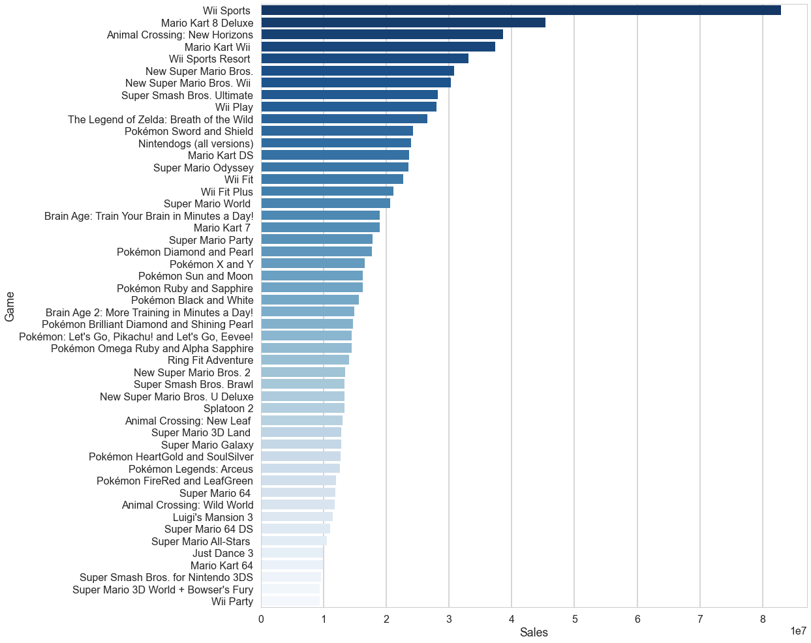
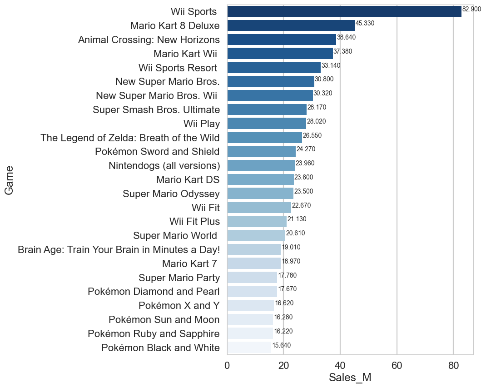
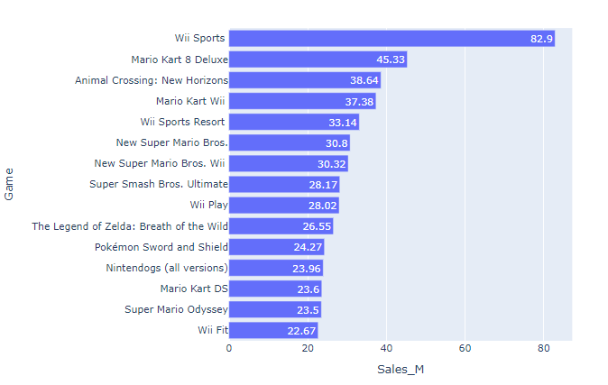

# data-viz-and-wrangling-tricks
An eclectic collection of useful data visualization and manipulation tricks in Python

## Matlotlib bars, orientation and reverse coloring

<figure>

</figure>

## Matplotlib bars with numbers

<figure>

</figure>

## Plotly bars with numbers

<figure>

</figure>